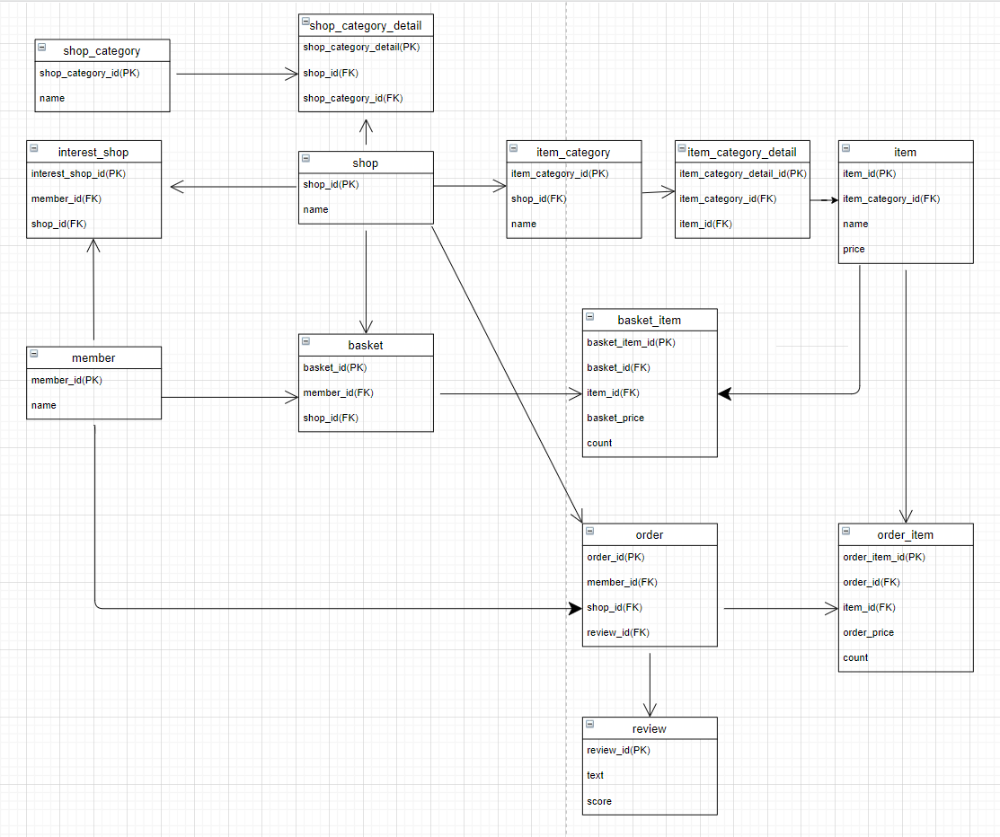

## 개발 동기

인프런에서 김영한님의 JPA와 관련된 강의를 수강하고 배운 기술을 사용해보고 싶어서 토이프로젝트를 진행해 보았다.

평소에 자주 사용하던 배달 주문 서비스를 이번 토이프로젝트의 주제로 결정했다.

## 개발 과정

인프런에서 강의를 수강하기 직전까지는 빨리 기술을 프로젝트에 적용해보고 싶었는데, 무엇을 해야 할지 몰라서 너무 막막했다.

처음에는 배달 주문 서비스를 만든다면 요구사항이 뭐가 주어질지 생각해 보았다.

그리고 테이블을 설계하고 있었는데, 내가 원했던 서비스는 생각보다 복잡했고 계속 노력해 보았지만 현재 내 수준으로는 감당이 안됐다.

내가 너무 욕심을 부리고 있다는 것을 깨달은 뒤에 테이블을 조금 많이 단순화 시켰다.

로그인, 회원등급, 이벤트, 할인 등 여러가지 기능을 없애고 테이블 설계를 끝냈다.

처음으로 강의에서만 보던 다이어그램을 작성해 보았는데, 어렵긴 했지만 그래도 다이어그램이 있으니 프로젝트를 하는 도중 테이블간의 관계를 이해하는데 많은 도움을 주었었다.

테이블 설계를 끝낸 이후에 엔티티 클래스를 개발하였고 리포지토리는 스프링 데이터 JPA를 통해 쉽게 개발했었다.

하지만 서비스를 개발할 때 내가 생각한 요구사항보다 필요한 기능이 너무 많았고, 화면을 개발해 본적이 없기 때문에 뷰 템플릿에서 어떤 정보가 들어와야 하는지 감을 잡을 수 없었다.

그래서 내가 구현하고 싶은 기능을 화면으로 먼저 개발하고 다시 생각해 보기로 했었다.

하지만 CSS, JavaScript를 잘 다루지 못하는 나는 어떻게 해야할지 고민하다가 영한님이 강의에서 사용하셨던 부트스트랩을 배워보기로 했다.

일주일간 부트스트랩을 배운 뒤 화면까지 잘 구현하고 나서야 서비스를 제대로 개발할 수 있었다.

서비스를 개발한 뒤 HTTP 강의에서 배웠던 Rest API 설계를 되새기며 컨트롤러까지 개발을 끝냈고, 정적 화면을 Thymeleaf를 이용해서 동적 화면으로 수정하는 것으로 프로젝트가 끝났다.

## 후기

요구사항을 정할 때 부족한 부분이 많이 느껴졌었다.

화면을 같이 구현하면서 더 자세하게 요구사항이 정해졌어야 된다고 생각이 들었다.

왜냐하면, 처음에는 단순하게 요구사항에 "검색" 이라고 적었지만, 우리가 배달의 민족이나 요기요에서 검색을 할 때 가게이름을 검색하는 경우도 있지만 음식을 검색하는 경우도 있으며, 검색창에 아무것도 입력하지 않고 검색을 하는 등 여러가지 신경써야할 부분이 많았다.

결국 화면마다 요구사항을 정확하게 다시 정의하게 되었고, 검색과 관련된 부분은 서비스 계층과 리포지토리 계층까지 수정하게 되었다.
